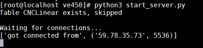
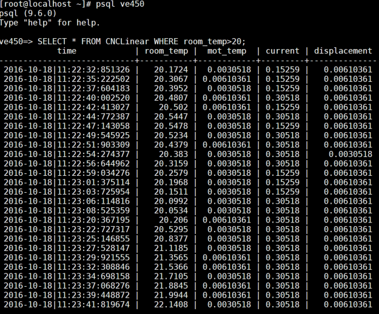
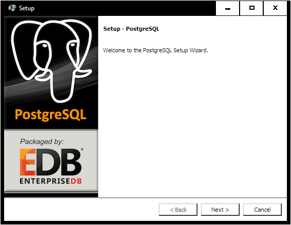
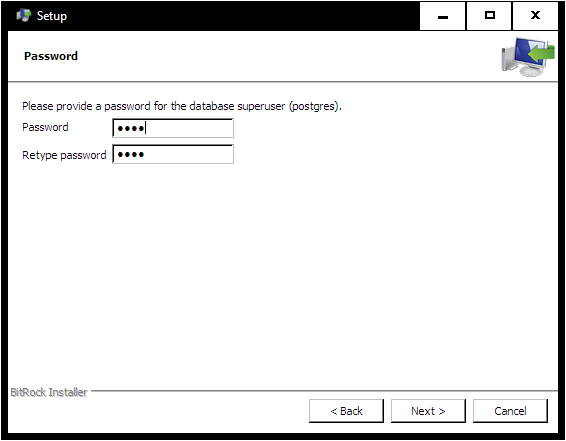
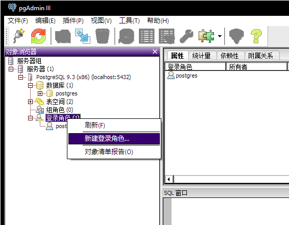
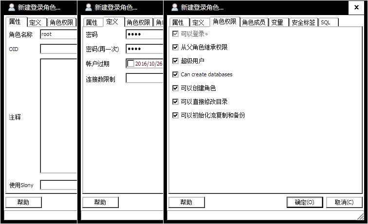
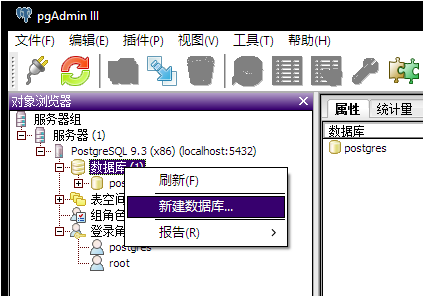
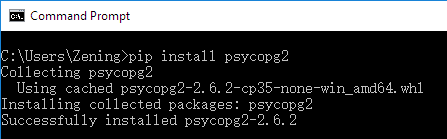

VE450 Team 4 Machine Learning Think and Speak

Author: Lu Zening
# How to deploy the server
## On CentOS 6
## Install PostgreSQL
1. Install PostgreSQL9.6 by command
    `sudo yum install postgres-9.6-i686`
2. Install PostgreSQL developer's kit
    `sudo yum install postgres_delevel`
3. Create a PostgreSQL user named *root*
    ```
    su - postgres
    psql
    create user root with superuser;
    \q
    exit
    ```
4. Create a database titled *ve450*
    ```
    su - root
    createdb ve450
    exit
    ```
## Conifgurate TCP/IP settings
1. Put all script files under the same folder.
2. Access the folder.
3. Open file *TCPconfig.py*, modify record `host_address=xxx.xxx.xxx.xxx` according to your host IP address. Save it.

## Start the server
1. Since the server uses the PostgreSQL database `ve450` to store sensor readings, please make sure you have created a database titled *ve450*.
2. Run command `python3 start_server.py` to run the services at the foreground. Run command `nohup python3 start_server.py &` to run the services at the background.
3. Power on the DTU module. The server will automatically connect to the module.
4. Once the connection is established, you will see data flows in.
5. Done for the server part.

    
## Inspect history sensor readings 
1. On the server, go back to the command line interface.
2. You can either terminate the server services or just put them to the background.
3. Run command `psql ve450` to access the database.
4. Type in the SQL command `SELECT * FROM CNCLinear;`, then hit *Enter*
5. All valid records will be printed on the terminal.
    
---
## On Windows
## Prepare PostgreSQL
1. Double click on the PostgreSQL installation package.

    
2. Don't stop clicking the `Next` buttion until you see the password settings. Arbitrarily pick a password (say `1234`).

    
3. Leave the port number as default. (`5432`)
4. Find executable file `C:\Program Files (x86)\PostgreSQL\9.3\bin\pgAdmin3`, double click.In the popped window, create a new user as is shown in the snapshot.
You can arbitrarily choose your password for this user (say `1234`).

    
    
5. After you created a new user, create a database owned by this user.
    
    
    
6. All done! You can now close `pgAdmin3`
## Install Python3 environment
1. Download the latest `Python3` installation package from URL: `https://www.python.org/ftp/python/3.5.2/python-3.5.2.exe`.
2. Double click on that executable file and install `Python3`.
3. After you installed `Python3`, enter the `Command Prompt` of your Windows OS. 
Type in and execute command `pip install psycopg2`.

    
## Start the server
1. Enter the `Command Prompt` of Windows.
2. Switch to the directory where you put the Python scripts related to the server.
3. Type in and execute command `python start_server.py`.
4. Don't close the `Command Prompt` window unless you would like to terminate the services.

