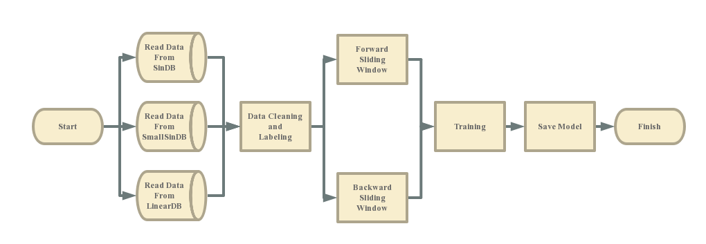
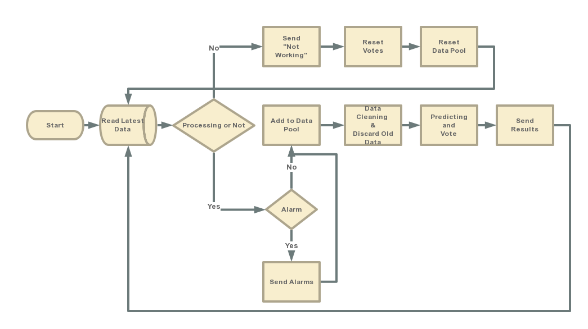

Thinking Algorithm
-------------
#How to Build Keras Environment
* You should have installed proper version of python
* Install pip using easy_install @$PYTHON_HOME/Scripts
```
sudo easy_install pip
```
* Install numpy, scipy, theano and keras
```
sudo pip install numpy
sudo pip install scipy
sudo pip install theano
sudo pip install keras
```
* Change backend of Keras to theano
```
vim ~/.keras/keras.json
#change "backend":"tensorflow" to "backend":"theano"    
```
* Import keras in python to check
#Trainning Process

#Thinking Process
