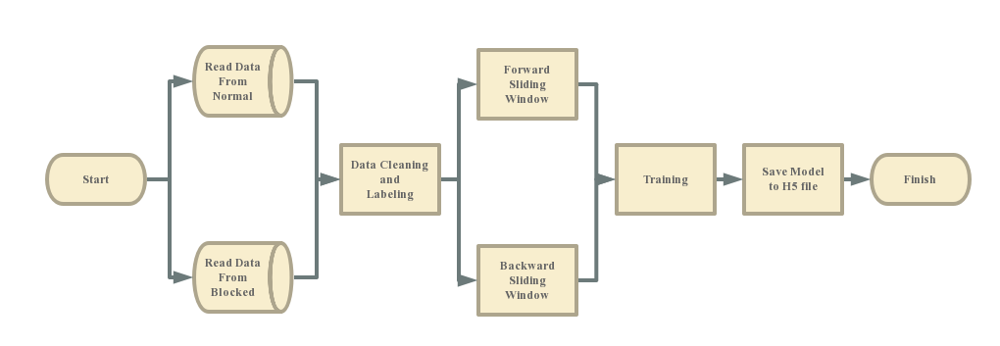

# Thinking Algorithm
-------------
## How to Build Keras Environment
* You should have installed proper version of python
* Install pip using easy_install @$PYTHON_HOME/Scripts
```
sudo easy_install pip
```
* Install numpy, scipy, theano and keras
```
sudo pip install numpy
sudo pip install scipy
sudo pip install theano
sudo pip install keras
```
* Change backend of Keras to theano
```
vim ~/.keras/keras.json
#change "backend":"tensorflow" to "backend":"theano"    
```
* Import keras in python to check
in terminal, type in the following commands
```
python3
>>> import keras
```
Setting up is done if there is error-free.

-------------

## How to start the thinking algorithms

Open up a terminal, type `python3 main.py`. Done.

## Trainning Process
### Type Recognizing

### Cut Blocking Detection


## Thinking Process

